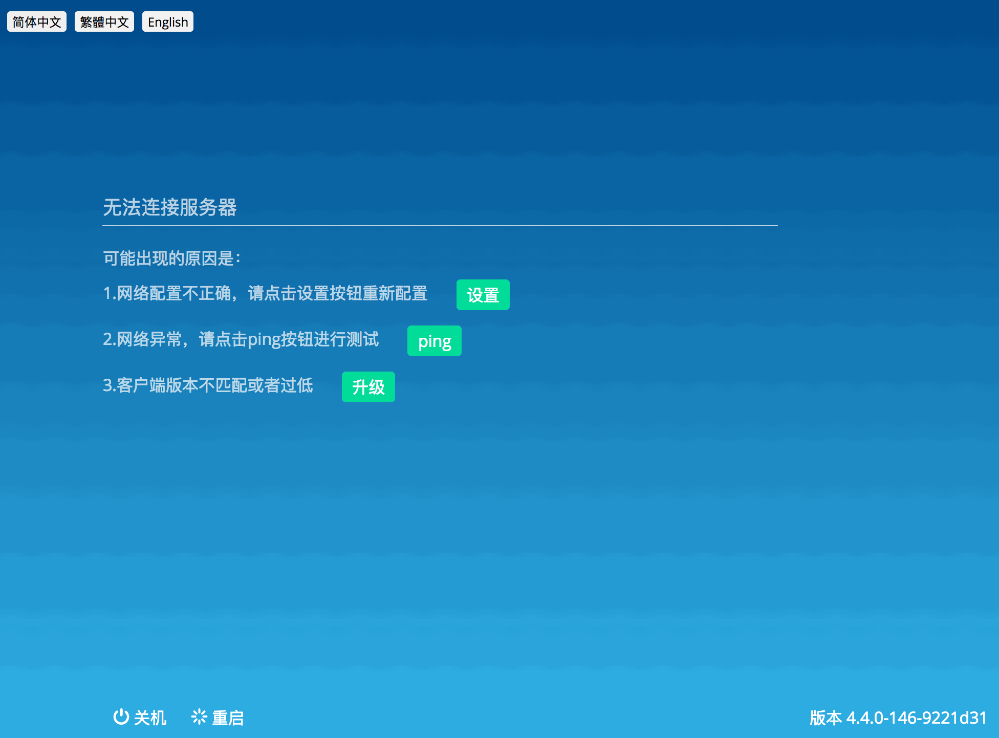
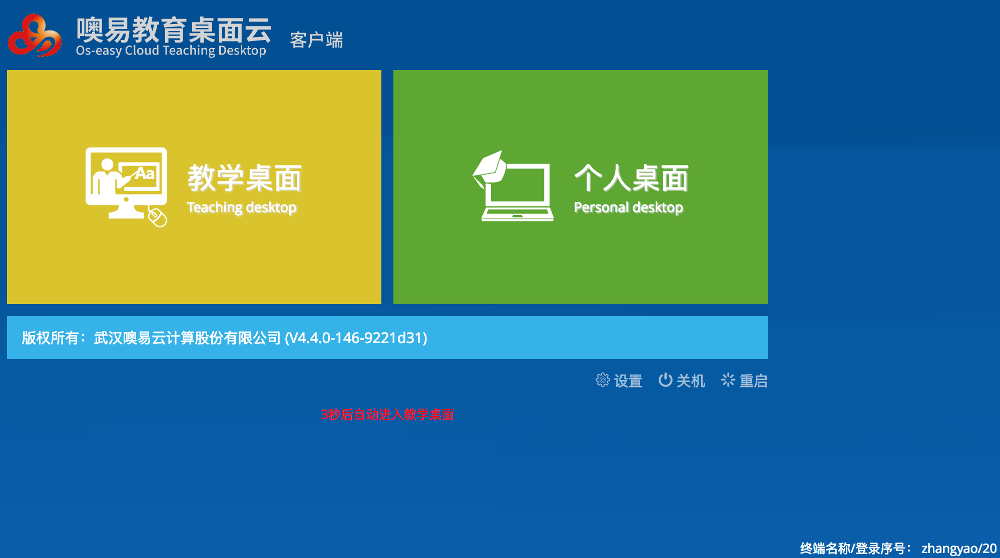

VDI 客户端的业务在 4.4.3 版本进行了重构，重构之后部分业务和之前的处理方式发生了变化，这篇文章主要说明 4.4.3 版本里 VDI 客户端的业务内容。

## 基础概念

在继续下面的内容之前，有必要先说明一些基础概念。

### VDI

VDI 是一个通用的概念，也是一个很热门的词汇，并不是说我们的项目组叫 VDI，VDI 就只跟我们的项目组有关系，可以参考[百度百科](https://baike.baidu.com/item/VDI/4310753)详细了解。

### 端

如果你看了上面 VDI 的详细说明，那么端的概念应该比较清楚了。这里简要的说明一下。
端的完整名称是 **瘦客户端**，详细说明可以参考[百度百科](https://baike.baidu.com/item/%E7%98%A6%E5%AE%A2%E6%88%B7%E7%AB%AF/194349?fr=aladdin)，瘦客户端提供了一个很小却完善的硬件环境，并运行合适的嵌入式操作系统，在运行时启动并连接一个远程桌面虚拟机。

目前我们的端有 3 种：windows, linux, android。

当我们说某个端是 windows 端的时候，表明这个端运行着 windows 操作系统。同样的：linux 端运行着 linux 系统，android 端运行着 android 操作系统。

不管哪个端，都运行着一个客户端程序，这个程序用于向 VDI 服务器发送数据，并处理来自 VDI 服务器的各种消息。这个程序就是我们这个项目。由于通常说 VDI 客户端一般指代端本身或内部的操作系统，而我们这个项目仅仅属于客户端的一部分，称之为 VDI 客户端并不合适，尤其是在和其它同事交流的时候。所以，为了更清晰的引用我们这个项目，一般称之为客户端资源层，或者客户端业务层。

### nw

[nw](http://docs.nwjs.io/en/latest/) 是一个可以在浏览器内运行 node.js 代码的 chromium 浏览器。目前在 windows 端，linux 端都是使用 nw 作为客户端资源层容器（android 端是一个 webview，也是一个基于 chromium 的环境，但不能执行 node.js 代码）。

客户端操作系统启动后，会自动启动 nw，之后由 nw 加载资源（也就是我们这个项目），并显示最终的客户端界面。

### 底层

当我们说底层的时候，我们在说运行在当前客户端操作系统内一个常驻的用于向资源层提供功能接口的服务。

目前 3 个端都有这个服务，而且服务的接口基本一致，也就是说在没有特殊说明的情况，拿到一个接口后，基本可以认为其它端也有同样的接口。目前底层向资源层提供的接口都是基于 HTTP 的。我们想调用某个接口，直接向这个接口发送 HTTP 请求就可以了。

## 业务说明

从前端页面来看，VDI 客户端的业务分为两类：初始化和主界面。初始化指的是 linux 端和 Android 端在第一次启动时，会显示一个初始化页面，如下图：



初始化页面的主要功能目标是设置端的网络参数，以完成初始化。初始化成功后，由底层切换到客户端主界面。主界面就是用户经常需要使用的界面了，客户端主界面如下图：



**注意：目前客户端并未有对应的需求文档，所有的界面及交互如无特殊说明，均为所见即所求，而且从很早之前的版本就是这样了。下面着重说明一些界面背后有特殊要求的业务，所以请仔细阅读本文档。**

### 初始化

初始化的核心功能是配置端的本地网络，配置过程有如下要求：

1. 启动初始化界面时，默认启动 DHCP，并自动获取端的 IP 地址，获取到 IP 地址后，填充 IP 网关等信息，同时使用 DHCP 服务器作为远程服务器，并填充相关字段，此时如若用户还没有点击过保存按钮，将自动填充密码并启动注册流程。此业务的需求场景是为了方便公司的实施人员批量部署端。
2. 点击保存按钮后，如果第 1 步的 DHCP 尚未获得 IP 地址，结束 DHCP 过程。保存相关信息成功后，开始注册过程。

此业务的实现可参考 [auto-dhcp.js](src/js/mixins/auto-dhcp.js) 及 [client-ui.js](../src/js/mixins/initial-ui.js#L95)

### 主界面

#### 通讯说明

从 4.4.3 开始，客户端在服务器和底层之间扮演的角色不再是信息展现层，而是负责在服务器和底层之间转发数据。从这个角度来说，我们的项目可称之为**客户端业务层**。

业务层和服务器之间的通讯使用 websocket，这个通讯是双向的，既可以发送消息给服务器，也可以收到服务器主动推送的消息。

业务层和底层之间的通讯使用 HTTP，为了保证双向通讯，业务层不停轮训底层提供的 loop_data 接口。

通讯代码目录说明：
```text
- backend
 | - lowlevel         // 底层通讯代码目录
 |  | index.js        // 底层通讯代码入口文件
 | - ws               // websocket 通讯代码目录
 |  | api.js          // websocket 封装 api
 |  | index.js        // websocket 通讯代码入口文件
```
默认情况，代码中已经加入了足够的注释，如果你发现理解起来还是不容易，及时向其它同事求助。
#### 桌面说明

你可能听说过 **教学桌面**、**个人桌面** 了，但是可能还不懂它们是什么意思。

本质上说，不管是什么桌面，都是一个[虚拟机](https://baike.baidu.com/item/%E8%99%9A%E6%8B%9F%E6%9C%BA)，个人桌面是个人用户的虚拟机，教学桌面是一批虚拟机的集合概念。

如果你不得不了解桌面的具体含义，可以操作操作管理台自己琢磨，也可以向产品经理求助。

目前开发常用的管理台地址为：[172.16.201.188](http://172.16.201.188)

产品经理有：熊锐、朱建臣、汪升

#### 业务说明

初始化完毕后，客户端就开始和服务器开始进行消息交互了，这个流程如下：

1. 根据本地配置信息初始化 websocket
2. 使用 websocket 发送注册消息，收到消息后转发给底层
3. &lt;等待用户进一步操作&gt;

当端配置了自动进入教学桌面，或者默认就是教学桌面时：

1. 使用 websocket 获取场景信息，如果获取失败则重试，最多重试 5 次
2. 如果获取到的场景只有1个，则自动启动倒计时。如果获取到的场景有多个，则锁定配置了自动进入的场景，倒计时后自动进入。
3. 任何时候，收到服务端推送的 `update_modes` 消息后（在重新排序，切换教室，多媒体上课等情况后会收到），主动拉取一次场景信息。

当端配置了自动进入个人桌面，或者默认就是个人桌面时：

1. 使用 websocket 发送用户登录信息，登录成功后会获取到个人桌面列表，如果个人桌面列表为空，则提示
2. 个人桌面没有自动更新机制，连接桌面并退出后，需要退出到登录界面，这样确保用户再登录后，可以拉取到最新的个人桌面列表

不管是教学桌面还是个人桌面，点击桌面图标后，客户端按照如下流程处理：

1. 记录当前桌面为连接中状态，发送 vm_connect 到服务端
2. 收到服务器的回复 vm_connect 消息，忽略
3. 收到服务器的 vm_connect_reply 消息，表明虚拟机已经准备好了，转发给底层，如果一直没有收到此消息，每 3 分钟重试一次，总共重试 10 次
4. 底层返回成功消息后，记录当前桌面为已连接状态，同时标记内部状态 `continueRegister` 为false，表示此后如果发生断网，仅重连但不重新注册
5. 用户主动或被动退出虚拟机后，会收到来自底层的 vm_logout 消息，将此消息转发给服务端，并记录此桌面为未连接状态，标记内部状态 `continueRegister` 为 true

#### 业务数据

业务层在和服务器、底层交流的时候，发送或接收到的数据格式是确定的。当你需要确认某个接口的数据格式时，可以参考 `.data` 目录。

`.data` 目录是什么？

`.data` 是存放假数据的目录。

`.data/request/` 下面存放了所有和底层交流所使用的数据。

`.data/websocket/` 下面存放了所有和服务器交流所使用的数据。

这些数据一方面方便了自测，一方面也记录了每个接口的数据格式。有任何数据方面的需求都可以在这里面找到。

**如果某些数据含义不是很清楚，及时向周围的同事求助**